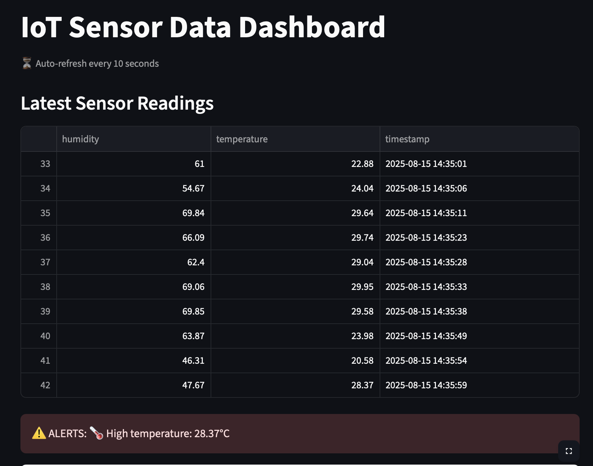

# IoT Data Platform

## 📌 Project Overview
This project simulates an IoT-based temperature & humidity sensor network.  
It collects data via a REST API, stores it in SQLite (local) or PostgreSQL (cloud), and visualizes it with a Streamlit dashboard.

**Key Features:**
- Simulated IoT sensor data (Python script)
- REST API (Flask) for data collection
- SQLite database for local storage, PostgreSQL for cloud
- Streamlit dashboard for visualization
- Automated tests and CI with GitHub Actions
- Real-time anomaly detection & auto-refresh dashboard

---

### 🔍 Anomaly Detection
The dashboard automatically refreshes every 10 seconds and checks for abnormal sensor readings:
- **High temperature alert:** If temperature exceeds 28°C
- **Low humidity alert:** If humidity drops below 45%
Alerts are displayed in red for quick recognition.

---

## 📸 Screenshot



---

## 🚀 Installation & Setup (Local)
### 1. Clone the repository
```bash
git clone https://github.com/Mitisdre/iot-data-platform.git
cd iot-data-platform
```

### 2. Create virtual environment & install dependencies
```bash
python3 -m venv .venv
source .venv/bin/activate
pip install -r requirements.txt
```

---

## ▶️ Running the Project Locally
### 1. Start the backend API
```bash
cd backend
python app.py
```

### 2. Run the sensor simulator
```bash
cd sensor_simulator
python sensor.py
```

### 3. Open the dashboard
```bash
streamlit run dashboard.py
```

---

## 🔌 Example API Requests

### 1. Add sensor data (POST)
```bash
curl -X POST http://127.0.0.1:5000/data   -H "Content-Type: application/json"   -d '{"temperature": 25.3, "humidity": 60}'
```

**Expected Response:**
```json
{
  "message": "Data saved",
  "data": {
    "temperature": 25.3,
    "humidity": 60,
    "timestamp": "2025-08-15T12:34:56.789123"
  }
}
```

---

### 2. Get all sensor data (GET)
```bash
curl http://127.0.0.1:5000/data
```

**Expected Response:**
```json
[
  {
    "temperature": 25.3,
    "humidity": 60,
    "timestamp": "2025-08-15T12:34:56.789123"
  }
]
```

---

## 🛠 Tech Stack
- **Backend:** Flask, Flask-CORS, Flask-SQLAlchemy
- **Frontend:** Streamlit
- **Database:** SQLite (local), PostgreSQL (cloud)
- **Testing:** Pytest
- **CI/CD:** GitHub Actions

---

## 📐 Project Architecture
```plaintext
+-------------------+         POST/GET         +-------------------+        +-------------------+
| Sensor Simulator  | ----------------------> |  Flask API Server  | -----> |   SQLite/PostgreSQL|
| (Python script)   |                         | (backend/app.py)   |        +-------------------+
+-------------------+                         |                   |
                                               |                   | -----> +-------------------+
                                               |                   |        | Streamlit Dashboard |
                                               +-------------------+        +-------------------+
```

---

## 🧪 Running Tests
```bash
pytest
```

---

## ☁️ Cloud Deployment

This project can be deployed to the cloud using **Render** with a PostgreSQL database.

### 1. Backend Deployment
1. Create a free account at [Render](https://render.com).
2. Create a new **PostgreSQL** instance and copy its **External Database URL**.
3. Create a new **Web Service**:
   - **Branch**: `main`
   - **Root Directory**: `backend`
   - **Build Command**: `pip install -r ../requirements.txt`
   - **Start Command**: `gunicorn app:app`
4. Add the following environment variables:
   - `DATABASE_URL` → Your PostgreSQL connection string
   - `PORT` → `10000` (optional, Render sets it automatically)
5. Deploy the service.  
   Example backend URL:  
   ```
   https://iot-data-platform.onrender.com
   ```

---

### 2. Dashboard Connection
1. Update `API_URL` in `dashboard.py`:
   ```python
   API_URL = "https://your-backend.onrender.com/data"
   ```
2. Run the dashboard locally:
   ```bash
   streamlit run dashboard.py
   ```

---

### 3. Sensor Simulator to Cloud
1. Update `API_URL` in `sensor.py`:
   ```python
   API_URL = "https://your-backend.onrender.com/data"
   ```
2. Run the simulator locally to send data to the cloud database:
   ```bash
   python sensor.py
   ```

---

## 🔮 Future Improvements
- **Advanced Anomaly Detection:** Implement ML models for predictive maintenance.
- **Automatic Dashboard Refresh:** Enable live updates without manual reloads.
- **Data Export:** Allow exporting collected data as CSV or Excel for further analysis.
- **User Authentication:** Add a login system to secure access to the dashboard and API.
- **Cloud Deployment Enhancements:** Deploy the dashboard as a cloud-hosted web app.
- **Real Sensor Integration:** Connect to actual IoT hardware (e.g., Raspberry Pi, ESP32).

---