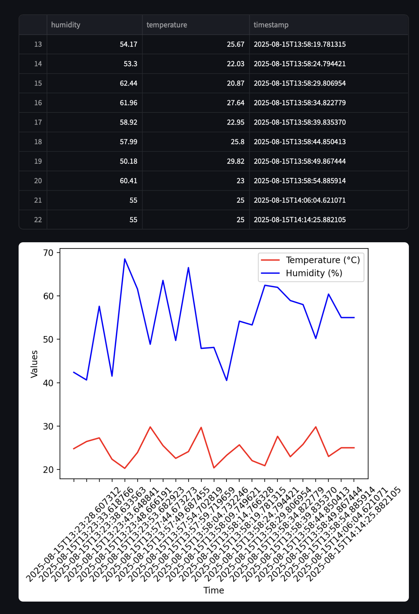

# IoT Data Platform

## 📌 Project Overview
This project simulates an IoT-based temperature & humidity sensor network.  
It collects data via a REST API, stores it in SQLite, and visualizes it with a Streamlit dashboard.

**Key Features:**
- Simulated IoT sensor data (Python script)
- REST API (Flask) for data collection
- SQLite database for storage
- Streamlit dashboard for visualization
- Automated tests and CI with GitHub Actions

---

## 📸 Screenshot


---

## 🚀 Installation & Setup
### 1. Clone the repository
```bash
git clone https://github.com/Mitisdre/iot-data-platform.git
cd iot-data-platform
```

### 2. Create virtual environment & install dependencies
```bash
python3 -m venv .venv
source .venv/bin/activate
pip install -r requirements.txt
```

---

## ▶️ Running the Project
### 1. Start the backend API
```bash
cd backend
python app.py
```

### 2. Run the sensor simulator
```bash
cd sensor_simulator
python sensor.py
```

### 3. Open the dashboard
```bash
streamlit run dashboard.py
```

---

## 🔌 Example API Requests

### 1. Add sensor data (POST)
```bash
curl -X POST http://127.0.0.1:5000/data   -H "Content-Type: application/json"   -d '{"temperature": 25.3, "humidity": 60}'
```

**Expected Response:**
```json
{
  "message": "Data saved",
  "data": {
    "temperature": 25.3,
    "humidity": 60,
    "timestamp": "2025-08-15T12:34:56.789123"
  }
}
```

---

### 2. Get all sensor data (GET)
```bash
curl http://127.0.0.1:5000/data
```

**Expected Response:**
```json
[
  {
    "temperature": 25.3,
    "humidity": 60,
    "timestamp": "2025-08-15T12:34:56.789123"
  }
]
```

---

## 🛠 Tech Stack
- **Backend:** Flask, Flask-CORS, Flask-SQLAlchemy
- **Frontend:** Streamlit
- **Database:** SQLite
- **Testing:** Pytest
- **CI/CD:** GitHub Actions

---

## 📐 Project Architecture
```plaintext
+-------------------+         POST/GET         +-------------------+        +-------------------+
| Sensor Simulator  | ----------------------> |  Flask API Server  | -----> |   SQLite Database |
| (Python script)   |                         | (backend/app.py)   |        +-------------------+
+-------------------+                         |                   |
                                               |                   | -----> +-------------------+
                                               |                   |        | Streamlit Dashboard |
                                               +-------------------+        +-------------------+
```

---

## 🧪 Running Tests
```bash
pytest
```

---

## 📄 License
MIT License
